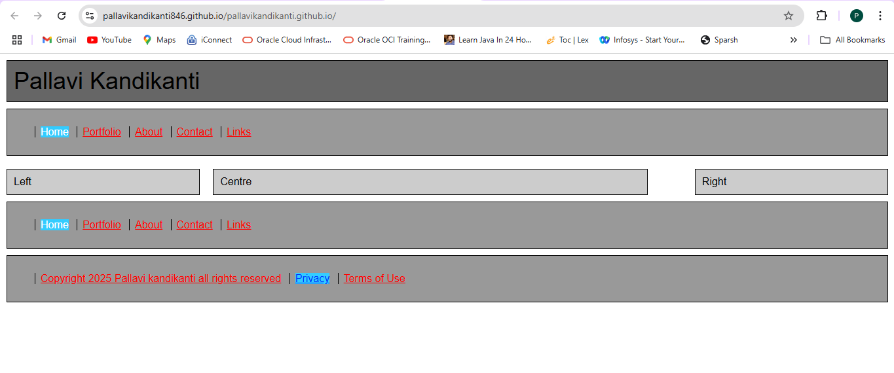

# Making a Simple Website
## Project Description
It's a Sample Website which shows the website name, and some links to navigate through it.
I have used HTML and CSS to create a simple website which has navigation and basic styles.
I faced a challenge where the background color changes when we are in a particular page in a Website.
The Future Features it will have is the all the page content for other pages within the Website.

